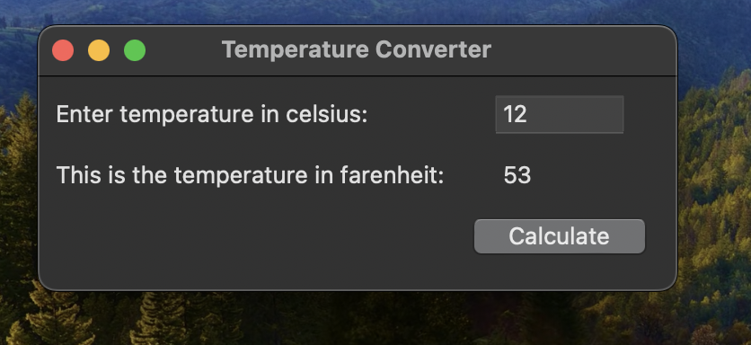

# Temperature Converter

This is my simple temperature converter GUI application built using Tkinter in Python.

## Live Demo



## Usage

1. Clone the repository:

    ```bash
    git clone https://github.com/josiah-mbao/temperature-converter.git
    cd temperature-converter
    ```

2. Install the required dependencies:

    ```bash
    pip install -r requirements.txt
    ```

3. Run the application:

    ```bash
    python main.py
    ```

4. Use the GUI to enter the temperature in Celsius and click the "Calculate" button. The equivalent temperature in Fahrenheit will be displayed.

## Dependencies

Make sure you have the required Python packages installed. You can install them using the provided `requirements.txt` file:

```bash
pip install -r requirements.txt


Note: If you come across any issues on MacOS, try the following command:
"brew install python-tk@3.12" . Replace "@3.12", with your python version.